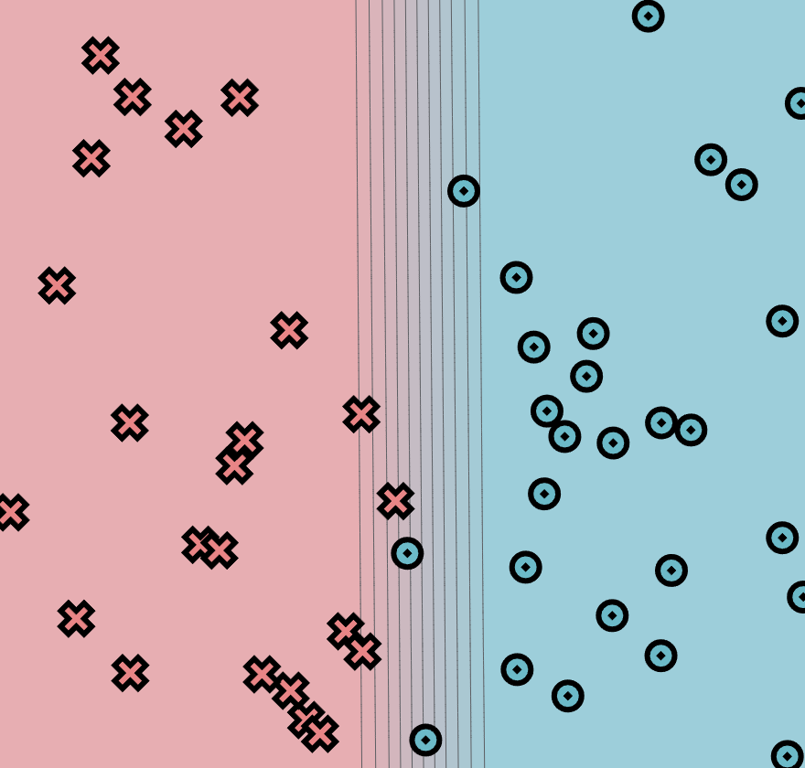
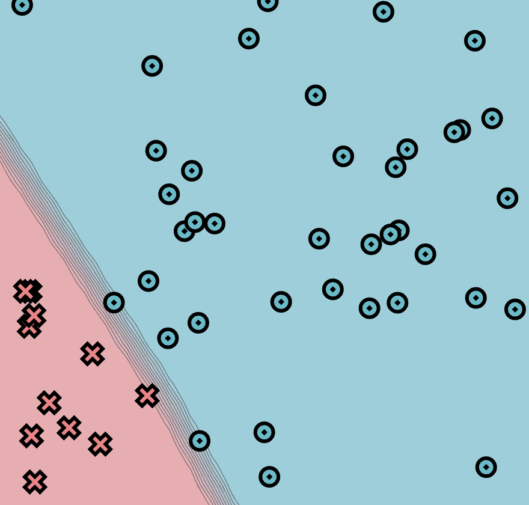
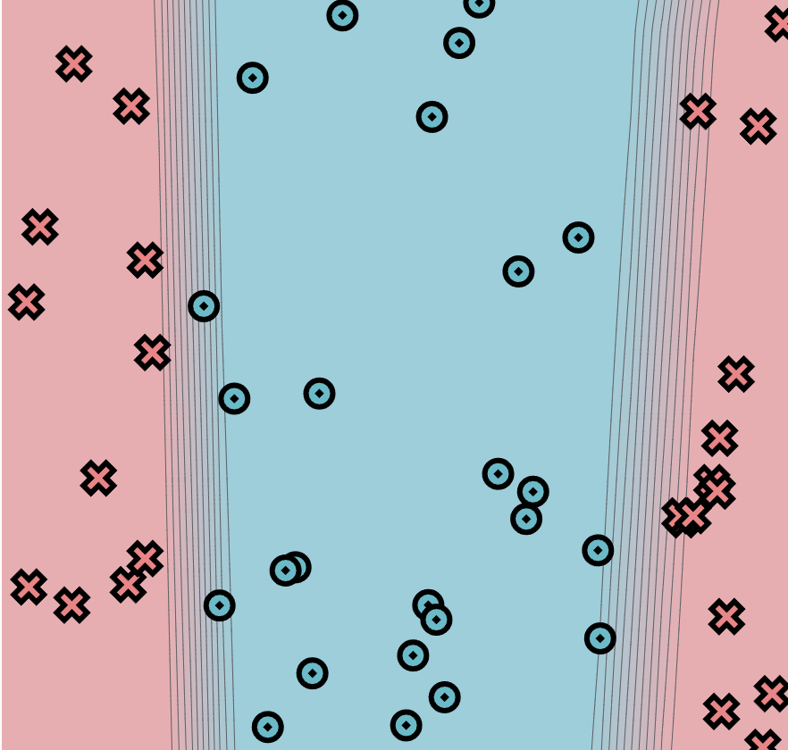
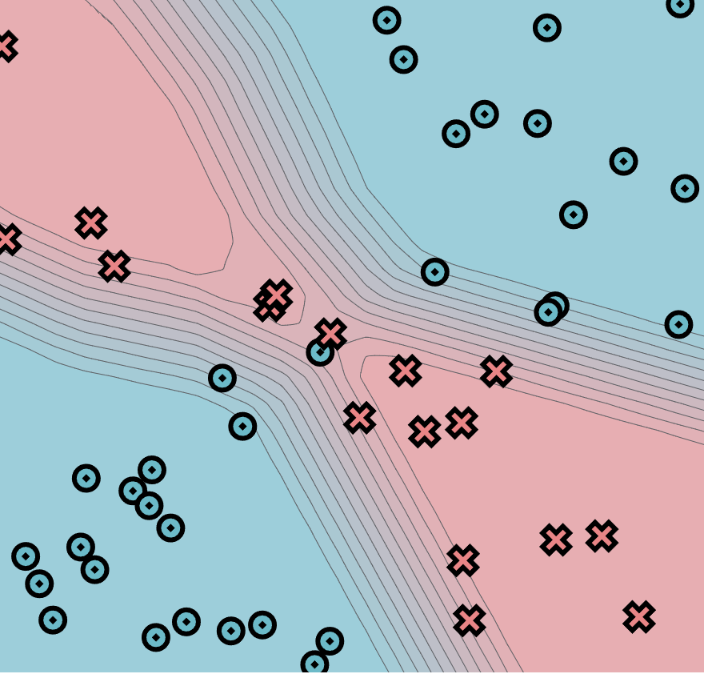

# MiniTorch Module 1

My solutions to [module 1](https://minitorch.github.io/module1.html) of [minitorch](https://minitorch.github.io/)

## Task 1.5

For the final task in this module we train neural network on 4 example datasets using our implementation of autodiff. The results of my training runs are below


### Simple dataset



<details>
  <summary>Training logs</summary>

  ```
  Epoch: 10/250, loss: 33.57870967816443, correct: 27
  Epoch: 20/250, loss: 32.38014564489488, correct: 27
  Epoch: 30/250, loss: 31.18730283564492, correct: 27
  Epoch: 10/250, loss: 36.209133882052704, correct: 23
  Epoch: 20/250, loss: 34.684381635181055, correct: 23
  Epoch: 30/250, loss: 33.841401522652376, correct: 27
  Epoch: 40/250, loss: 32.043354286896616, correct: 27
  Epoch: 50/250, loss: 30.906993926263223, correct: 32
  Epoch: 60/250, loss: 29.617800698293422, correct: 36
  Epoch: 70/250, loss: 28.12307968142727, correct: 38
  Epoch: 80/250, loss: 26.385924151838072, correct: 41
  Epoch: 90/250, loss: 24.41816867529916, correct: 43
  Epoch: 100/250, loss: 22.255839299494998, correct: 43
  Epoch: 110/250, loss: 19.976970756113847, correct: 44
  Epoch: 120/250, loss: 17.717743483799037, correct: 47
  Epoch: 130/250, loss: 15.566535459444884, correct: 48
  Epoch: 140/250, loss: 13.682285017217552, correct: 48
  Epoch: 150/250, loss: 12.075863989478037, correct: 49
  Epoch: 160/250, loss: 10.720852165695284, correct: 49
  Epoch: 170/250, loss: 9.583678613613616, correct: 49
  Epoch: 180/250, loss: 8.6312869550646, correct: 50
  Epoch: 190/250, loss: 7.827345978703899, correct: 50
  Epoch: 200/250, loss: 7.1503399220712485, correct: 50
  Epoch: 210/250, loss: 6.57850023405641, correct: 50
  Epoch: 220/250, loss: 6.0958336099282295, correct: 50
  Epoch: 230/250, loss: 5.6873535171280345, correct: 50
  Epoch: 240/250, loss: 5.336949824802044, correct: 50
  Epoch: 250/250, loss: 5.034158743092247, correct: 50
  ```
</details>

### Diagonal dataset



<details>
  <summary>Training logs</summary>

  ```
  Epoch: 10/250, loss: 18.32941525479233, correct: 39
  Epoch: 20/250, loss: 10.32448648679249, correct: 49
  Epoch: 30/250, loss: 6.086592185259401, correct: 49
  Epoch: 40/250, loss: 4.189229184025262, correct: 50
  Epoch: 50/250, loss: 3.224376837409237, correct: 50
  Epoch: 60/250, loss: 2.6667513420546474, correct: 50
  Epoch: 70/250, loss: 2.306539804149031, correct: 50
  Epoch: 80/250, loss: 2.0587018226233575, correct: 50
  Epoch: 90/250, loss: 1.870503181398564, correct: 50
  Epoch: 100/250, loss: 1.7289691180813327, correct: 50
  Epoch: 110/250, loss: 1.6089789106552832, correct: 50
  Epoch: 120/250, loss: 1.5121190582682094, correct: 50
  Epoch: 130/250, loss: 1.4273812030158264, correct: 50
  Epoch: 140/250, loss: 1.3545000249739212, correct: 50
  Epoch: 150/250, loss: 1.2900074441850495, correct: 50
  Epoch: 160/250, loss: 1.2332462973141618, correct: 50
  Epoch: 170/250, loss: 1.1782090152758489, correct: 50
  Epoch: 180/250, loss: 1.1331765926061474, correct: 50
  Epoch: 190/250, loss: 1.0900511560897428, correct: 50
  Epoch: 200/250, loss: 1.0478732973261582, correct: 50
  Epoch: 210/250, loss: 1.009384095343514, correct: 50
  Epoch: 220/250, loss: 0.9741846991158771, correct: 50
  Epoch: 230/250, loss: 0.9416898789505683, correct: 50
  Epoch: 240/250, loss: 0.9114849395045108, correct: 50
  Epoch: 250/250, loss: 0.883266831017266, correct: 50
  ```
</details>

### Split dataset



<details>
  <summary>Training logs</summary>

  ```
  Epoch: 10/500, loss: 33.77286049520026, correct: 32
  Epoch: 20/500, loss: 31.76385700462247, correct: 38
  Epoch: 30/500, loss: 31.100341277494636, correct: 38
  Epoch: 40/500, loss: 30.492930708085183, correct: 39
  Epoch: 50/500, loss: 29.92078732490928, correct: 41
  Epoch: 60/500, loss: 29.298893526664727, correct: 42
  Epoch: 70/500, loss: 28.63884973225734, correct: 42
  Epoch: 80/500, loss: 27.955232612088803, correct: 43
  Epoch: 90/500, loss: 27.223587785327414, correct: 45
  Epoch: 100/500, loss: 26.453931938743946, correct: 45
  Epoch: 110/500, loss: 25.614467915638517, correct: 45
  Epoch: 120/500, loss: 24.689348612862513, correct: 45
  Epoch: 130/500, loss: 23.769413476603336, correct: 47
  Epoch: 140/500, loss: 22.81478714466692, correct: 48
  Epoch: 150/500, loss: 21.843322353616045, correct: 48
  Epoch: 160/500, loss: 20.853482179262176, correct: 48
  Epoch: 170/500, loss: 19.84850407268375, correct: 48
  Epoch: 180/500, loss: 18.836612516340995, correct: 48
  Epoch: 190/500, loss: 17.841178764628758, correct: 48
  Epoch: 200/500, loss: 16.87169777834747, correct: 48
  Epoch: 210/500, loss: 15.934548064644614, correct: 48
  Epoch: 220/500, loss: 15.034975364862929, correct: 48
  Epoch: 230/500, loss: 14.188507099629863, correct: 48
  Epoch: 240/500, loss: 13.399507181872092, correct: 48
  Epoch: 250/500, loss: 12.664350676621543, correct: 48
  Epoch: 260/500, loss: 11.975497227886192, correct: 48
  Epoch: 270/500, loss: 11.33154756516208, correct: 48
  Epoch: 280/500, loss: 10.731715043584977, correct: 48
  Epoch: 290/500, loss: 10.173379093542694, correct: 49
  Epoch: 300/500, loss: 9.655080737661084, correct: 49
  Epoch: 310/500, loss: 9.173245823154447, correct: 49
  Epoch: 320/500, loss: 8.722719479086754, correct: 49
  Epoch: 330/500, loss: 8.304956554231756, correct: 49
  Epoch: 340/500, loss: 7.9140812424297655, correct: 49
  Epoch: 350/500, loss: 7.5314244874428935, correct: 50
  Epoch: 360/500, loss: 7.166768816306093, correct: 50
  Epoch: 370/500, loss: 6.8290711172512815, correct: 50
  Epoch: 380/500, loss: 6.531690113947322, correct: 50
  Epoch: 390/500, loss: 6.2684874721994985, correct: 50
  Epoch: 400/500, loss: 6.023381748426436, correct: 50
  Epoch: 410/500, loss: 5.794507185093557, correct: 50
  Epoch: 420/500, loss: 5.580028907682258, correct: 50
  Epoch: 430/500, loss: 5.378647060299996, correct: 50
  Epoch: 440/500, loss: 5.189212082882671, correct: 50
  Epoch: 450/500, loss: 5.01070383256495, correct: 50
  Epoch: 460/500, loss: 4.842263626034296, correct: 50
  Epoch: 470/500, loss: 4.683091664324445, correct: 50
  Epoch: 480/500, loss: 4.532383288458831, correct: 50
  Epoch: 490/500, loss: 4.389488044558126, correct: 50
  Epoch: 500/500, loss: 4.253799942157014, correct: 50
  ```
</details>

### XOR dataset



<details>
  <summary>Training logs</summary>

  ```
  Epoch: 10/500, loss: 31.7371235823091, correct: 33
  Epoch: 20/500, loss: 31.284656504900536, correct: 33
  Epoch: 30/500, loss: 30.92401067477433, correct: 33
  Epoch: 40/500, loss: 30.62107108051321, correct: 33
  Epoch: 50/500, loss: 30.374246856070595, correct: 33
  Epoch: 60/500, loss: 30.15260774134871, correct: 33
  Epoch: 70/500, loss: 29.926001908788315, correct: 34
  Epoch: 80/500, loss: 29.70909512171964, correct: 34
  Epoch: 90/500, loss: 29.48045658143187, correct: 35
  Epoch: 100/500, loss: 29.254452476212148, correct: 36
  Epoch: 110/500, loss: 29.023640426345544, correct: 37
  Epoch: 120/500, loss: 28.758326959946555, correct: 37
  Epoch: 130/500, loss: 28.489688009349592, correct: 37
  Epoch: 140/500, loss: 28.251062958182025, correct: 38
  Epoch: 150/500, loss: 28.01318728206121, correct: 38
  Epoch: 160/500, loss: 27.773002655837516, correct: 38
  Epoch: 170/500, loss: 27.529041677078013, correct: 38
  Epoch: 180/500, loss: 27.26470835263562, correct: 38
  Epoch: 190/500, loss: 26.92987571826668, correct: 38
  Epoch: 200/500, loss: 26.554240180529156, correct: 38
  Epoch: 210/500, loss: 26.186523848259604, correct: 38
  Epoch: 220/500, loss: 25.738143163292822, correct: 36
  Epoch: 230/500, loss: 25.22643775758535, correct: 37
  Epoch: 240/500, loss: 24.674370093074256, correct: 37
  Epoch: 250/500, loss: 24.088094417548724, correct: 38
  Epoch: 260/500, loss: 23.412195702412404, correct: 38
  Epoch: 270/500, loss: 22.684615594559798, correct: 39
  Epoch: 280/500, loss: 21.923449236734903, correct: 39
  Epoch: 290/500, loss: 21.125146096032392, correct: 40
  Epoch: 300/500, loss: 20.31241300964025, correct: 41
  Epoch: 310/500, loss: 19.47026414455733, correct: 41
  Epoch: 320/500, loss: 18.60709247956104, correct: 42
  Epoch: 330/500, loss: 17.745054329928596, correct: 42
  Epoch: 340/500, loss: 16.886209403455528, correct: 42
  Epoch: 350/500, loss: 15.986564607694486, correct: 46
  Epoch: 360/500, loss: 15.109991018915705, correct: 47
  Epoch: 370/500, loss: 14.290896366061988, correct: 47
  Epoch: 380/500, loss: 13.519714739751171, correct: 49
  Epoch: 390/500, loss: 12.794842575198379, correct: 48
  Epoch: 400/500, loss: 12.123328737657456, correct: 49
  Epoch: 410/500, loss: 11.507125873377182, correct: 49
  Epoch: 420/500, loss: 10.94429642390645, correct: 49
  Epoch: 430/500, loss: 10.431805628479534, correct: 49
  Epoch: 440/500, loss: 9.963442539213686, correct: 49
  Epoch: 450/500, loss: 9.53820765456386, correct: 49
  Epoch: 460/500, loss: 9.152365302158008, correct: 49
  Epoch: 470/500, loss: 8.802737699877584, correct: 49
  Epoch: 480/500, loss: 8.4864152285414, correct: 49
  Epoch: 490/500, loss: 8.196431079483776, correct: 49
  Epoch: 500/500, loss: 7.932552477590808, correct: 49
  ```
</details>
